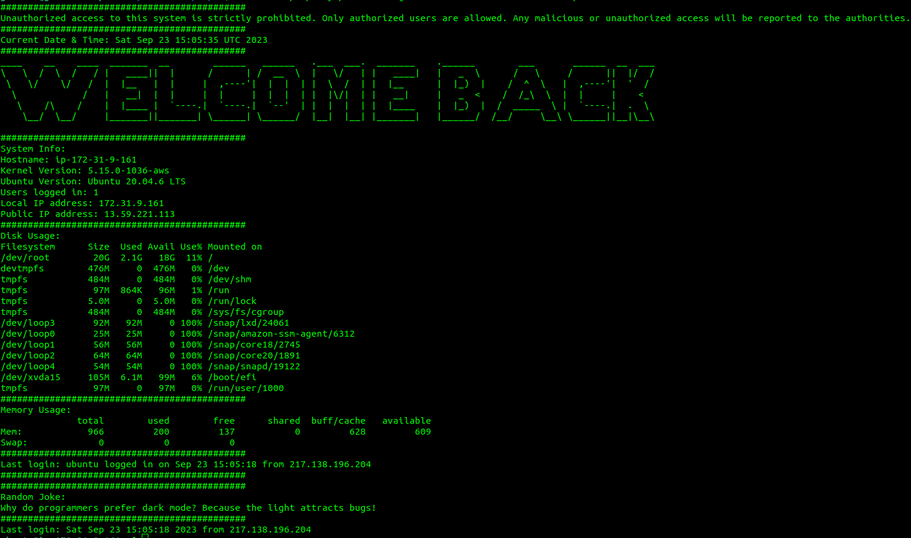

# Custom Message of the Day (MotD) for Ubuntu Servers

  

This script allows you to set up a custom Message of the Day (MotD) for your Ubuntu server. The MotD is displayed when a user logs into the system via SSH or on the terminal.

  

## Prerequisites

  

Firstly, update the package index files on your system, this can be acheive by running the following command:

`sudo apt update`

**Ensure the following dependencies are installed on your Ubuntu system:**: 

-   **Python3**: To install, run:

`sudo apt install python3 -y`

-  **Python Requests Module**: Install using pip (Python package installer):

  

`sudo apt install python3-pip -y`

  

`pip3 install requests`

-  **curl**: To install, run:

`sudo apt install curl -y`

  

-  **jq**: To install, run:

  

`sudo apt install jq -y`

  
  

## Usage

  

1.  **Disable Default MOTD**:

To disable the existing default MOTD, remove the executable permissions from the existing MOTD files:

`sudo chmod -x /etc/update-motd.d/*`

2.  **Download the Custom MOTD Script and Set Permissions**:

Clone the repository and copy the script to the appropriate directory, then make it executable:

  

`git clone https://github.com/Just-A-Random-IT-Guy/MOTD.git`

  

`cd MOTD`

  

`sudo cp 99-custom-motd /etc/update-motd.d/`

  

`sudo chmod +x /etc/update-motd.d/99-custom-motd`

  

3.  **Log Out and Log In**:

Log out and log back in to your Ubuntu system via SSH or on the terminal to see the new custom Message of the Day.

If all the steps above we're following correctly, your new (MOTD) Message of The Day should look limilar to the one below:

